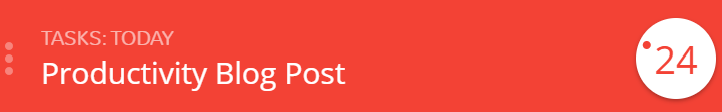
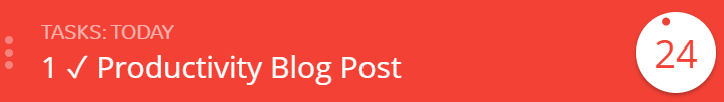

The story is told of a farmer who set out to plow the southern field one spring morning. Although it was important work, he did not assess in advance exactly what had to be done or a plan for how he was going to do it. He had started early by oiling his tractor, and he knew he needed more oil, so he went to the barn to get it. On the way to the barn, he noticed that the pigs had not been fed. This sent him to the cradle of corn, where he saw some sacks. That reminded him that the potatoes were sprouting, so he started toward the potato hole. Going through the wood pile, he remembered that his wife wanted some firewood for the house. While he was collecting sticks, he saw a chicken that was sick, so he left the wood and went to his aid. When night came, the tractor was still in the barn, and the field to the south still not plowed. The poor farmer had worked hard all day, but had not accomplished the main thing he had to do that day.

I'm hesitant to write this post for a number of reasons. First, I don't want this to come off as prescriptive in any way. I'm a strong believer that, when it comes to productivity, people should find whatever works best for them, and then do it. Second, I don't want to give the impression that I believe myself to be an expert in the psychology of productivity or a master of planning and executing tasks in my own life. I've learned a lot of things from a lot of smart people, and I've seen the benefits of putting their ideas into practice, but I am far from perfect. This post is just a medium for me to share some of the things that I've learned in my years of experimentation and research with my own productivity. Like you, I am constantly juggling the different pieces of my life, and this system has made it easier to keep them all afloat.

Instead of describing my whole process for capturing, processing, planning and executing my tasks in a step-by-step fashion, I just want to share some of the tools I use, habits I try to keep and what they do for me. With the current outbreak of COVID-19 and all that comes with it, especially working from home 100% of the time, I've found these tools and habits to be more important than ever. I hope some of this is helpful for you, too.

## My Task Board

[Trello](https://trello.com/) is the main hub for all of my productivity tools. All of my tasks are found here. I love Trello because it's genuinely fun to use, it's easy to see and update the status of each task and it's the closest digital tool to a "sticky note task board" as I've used. There's also a pretty rich ecosystem of tools that add additional features to Trello. I'll discuss a few of them below.

I've played around with many other ideas for managing my tasks - hierarchical lists, flat lists, GitHub projects, Jira, Azure DevOps, and many, many more. I do think that all of these tools have their place for certain use cases. I still use some of these tools for certain scenarios, but Trello is by far my favorite. I really enjoy being able to have all my tasks in one place while still being able to organize those tasks into discrete buckets. My Trello board basically has the following layout:

- Today
- This Week
- Done
- Triage
- Waiting For
- *...Categories*
- Things I'd like to do

Here's an explanation of what these lists do for me:

`Today` - I keep my `Today` list front and center because that's what I've committed to do today. The `Today` list is the first list I can see if I open the Trello app on my phone, and my eyes naturally go to the left side of the screen on my laptop. This, to me, is the most important list because if I'm not actually *doing* something *today*, what's the point in planning at all? Daily planning is a crucial component to keeping this list up to date and useful, and I'll discuss this more below.

`This Week` - This list represents the body of work that I've committed to during the week. It enables a quicker daily planning session, as I don't need to scan the entire board to decide which things I want to get done today. I'll discuss in more detail in my Weekly Planning section below.

`Done` - This, perhaps to your great surprise, holds the tasks that are done. In the past, I've just archived the card when it's done, but I found that I get a lot more joy out of moving the card over to the done column than letting it disappear in to the digital void. Plus, at the end of the week, I have a [Butler](https://help.trello.com/article/1198-an-intro-to-butler) policy (again, later) in place to generate a report of everything that I did during the week, send me an email with the results and then ceremoniously archive each card to clear space for the coming week. It's magical.

`Triage` - This is the birthplace of all my tasks. If there are tasks that come up that I *know* are urgent and must get done either today or this week, I'll just put them directly in the appropriate list. By having this one place where all the ideas are collected, I can be sure that I'm not missing a captured idea just because it's hidden in the bottom of one of my categorical lists. It also forces me to prioritize incoming tasks on at least a daily basis. Because my Trello board is my task hub, if a task or thought can make it to my Trello board, I can be 100% certain that I'll be forced to deal with it at some point.

`Waiting For` - Nothing generates more conscious or sub-conscious frustration for me than to see a task in my list that I can do nothing about. By having a landing spot for tasks that require an action/event outside of my control, I can let my mind rest, knowing that I've done all that I can. This list is also scanned during my morning planning just in case that action/event has happened and I can move forward to finishing the task.

`Categorical Lists` - I used to just have one long backlog of tasks that got prioritized each week. I switched to keeping categorical lists for two reasons:

1. More **compartmentalization**. I really like to be able to focus on the thing I want to focus on when I want to focus on that thing. If I can look at one list that contains all my pending tasks for that context (outside of the tasks that need to be done today or this week), it just makes me feel warm inside.
2. Just in case I'm in the **"right place, right time"** to do a task that I didn't necessarily plan on. For example, I have an `Errands` list. If I'm out and about with my two little boys and want to give my wife a little extra time to just sit in peace without a baby in her arms or a toddler climbing all over her, I'll pull up the list and see if there is anything we can go do together.

`Things I'd like to do` - Often times, a task will come to mind that is neither urgent nor super important, but things that would be nice to have done at some point. For example, right now in this list, I have several blog posts I'd like to write, I have a task to reorganize my workout playlist and a task to start

To make sure these categories are not lost as the tasks move through the different lists, I have [Butler](https://help.trello.com/article/1198-an-intro-to-butler) policies (once again, you'll read more about this later... stop trying to jump ahead) that automatically apply the appropriate label to cards as they are moved into the list. This gives me the capability of filtering my entire board to see only tasks with that label, even if they are no longer in their categorical list. For example, when I'm at work, it's nice to see tasks that I'm doing `This Week` or `Today` without having to scan through the other tasks in those lists.

## Capturing Tools

I've found that quickly and frequently capturing tasks, thoughts and ideas can be one of the greatest challenges to getting things done. I don't know about you, but I often remember things I need to do in places or times that are not exactly opportune for getting that thing done. So having easy & quick ways for capturing those thoughts with minimal resistance is pretty crucial. Here are a few tools that I use:

### Google Keep

Sometimes I'll have thoughts and ideas that I haven't quite formulated into tasks yet. It could be an epiphany about something I'd like to do better, a cool quote I heard or just a scratch pad to dump my current train of thought. For these and any other non-task thoughts, I use Google Keep. You can think of Google Keep as my RAM of ideas. Any time a thought pops into my head that I want to make sure I capture, it's a simple tap away from the widget on my phone. I also use Google Assistant for this if I want to take a note without the use of my hands, simply by saying "Hey Google, make a note..."

Google Keep only really has 3 "stages" a note can be in: a normal note, a pinned note, and an archived note. For that reason, I don't like to keep notes in there for a long time. It tends to make me feel scattered and unorganized. Instead, I try to clear out all of my notes each week during my weekly planning. Often times these notes lead to action items for my Trello board, other times they are just thoughts, impressions or ideas that I want to make sure I hold onto. That's where OneNote comes into play 👇.

### OneNote

OneNote does three things for me: keeps my "big 3" top of mind, is my daily code journal/digital scratch pad throughout the day, and it acts as my long-term storage for thoughts and ideas.

#### Big 3

I mentioned earlier that in my daily planning, I try to envision my "Big 3" that I want to accomplish by then end of the day. These often end up being closer to "themes" of tasks than actual broken-down tasks that I can accomplish in a Pomello or two. Trello doesn't seem like the best place for that. So I keep a OneNote page open, specific to each day, where I've defined by Big 3 right at the top. This helps me keep my Big 3 top of mind throughout the day. 

#### Code Journal/Scratch Pad

In that same "Daily Notes" page, I keep all of my notes for the day. This can be notes from meetings, but more importantly, it's my **code journal**. In my job as a software engineer, I'm constantly trying to solve problems with the constraints that I'm given. There are times when I try _a lot_ of different approaches because I run into road blocks along the way. Sometimes the most obvious approach has a constraint that makes impossible (or at least more difficult than it's worth), but that usually isn't clear from the start. When I take things back to my team, if someone asks, _"Why didn't you just do {insert failed approach here}?"_ I want to be able to remember why I made the decisions that I did. 

If a decision I make or a constraint that I discover seems like something that would be useful to future developers, I try to leave a quick comment in the code and/or add details somewhere in a documentation file. , as a comment on a pull request, or even somewhere in the document 
TODO - REMOVE GOOGLE KEEP REFERENCES
#### Long-Term Storage

I love the ability it gives me to compartmentalize things into notebooks, sections, pages, and even sub-pages. Everything is searchable (even the handwriting pages from notes I've taken on my Surface), which makes it great if I can remember just a word or two from the note I'm looking for. I don't think the mobile app is as snappy as Google Keep. There's a pretty significant delay in start-up at times and that can be pretty crucial when I'm trying to capture a fleeting idea. Plus, it's pretty easy for things to be hidden deep inside the caverns of compartmentalization I mentioned above. For those reason, I don't like it to be my "bucket" for new ideas that will need to be triaged. It's more a final resting ground for the ideas once I've been able to find them a home that makes sense.

### Widgets

If I have a quick thought while I'm on the go, I actually have a widget on my phone (thank you Android) that lets me tap once and type in the task and sends it directly to my `Triage` list. I have another widget for creating notes in Google Keep as well as link widgets for OneNote pages that I refer to often.

### Google Assistant & IFTTT (If This Then That)

I already mentioned my usage of Google Assistant to take notes if I'm driving, cooking or otherwise unable to use my hands. However, I'd also like to make sure I can capture actionable tasks inside my Trello board in that same context. Luckily, there already existed an [IFTTT hook](https://ifttt.com/applets/L3Whbwie-tell-google-assistant-to-create-new-task-card-on-trello) that integrates Trello and my Google Assistant, enabling me to just say, "Hey Google, Add a task to finish my productivity blog post," and voila - the task "Finsih my productivity blog post" is added to my `Triage` list.

## Automation Tools

I. love. automation. That's actually one of the main reasons I got into computer science. I'm not like some developers, who remember programming on the Altair 8800 their dad brought home from work. No, my first "programming experience" came out of a more practical necessity. As a 10-year old with an extensive basketball, baseball and football card collection, I wanted a quick and easy way to manage and track my precious assets, which would make me more effective in trading cards with my friends. I built a simple spreadsheet containing all of my cards, with columns for attributes describing the card such as `Player`, `Team`, `Year`, `Is Rookie Card`, etc. From the moment I wrote a simple `=SUM(` formula that counted the number of Rookie Cards I owned without having to count them myself, I was forever changed. I discovered that I could have a computer do something menial _for me_, and that it would free me up to focus on higher level thinking or tasks, such as being the GM of my own imaginary multi-sport franchise.

I try to automate as many simple tasks as I can so that I don't have to think about them, freeing me up to focus on the bigger picture or my current task at hand.

### Butler

At last, you've made it to the section you've been waiting for. It's been a long, rough journey through these last few paragraphs... but we made it. 

[Butler](https://help.trello.com/article/1198-an-intro-to-butler) was originally developed as a 3rd party Trello add-in, but was recently acquired by Trello to be a native part of the platform. It's a tool for automating tasks in Trello. Users can set up policies that are triggered by certain rules, due dates of cards, specific times in a day, week or month, etc. They can then apply actions that will occur when that policy is triggered.

Here are some example Butler policies that I have run on my board:

- When a card is added to list "Done", mark the due date as complete, and check all the items in all the checklists on the card
- When a card is added to the board by me, add an empty checklist named "Acceptance Criteria" to the card
- Every Friday at 6:00 pm, copy each card in list "Templates" with a name starting with "Maintenance Tasks" to list "Today"
- Every Friday at 6:00 pm, move 1 randomly-selected cards from list "Things I'd like to do" to list "This Week"
- On the Saturday before a card is due at 5:00 pm, move the card to the top of list "This Week"
- When a card with a name starting with "Pack for" is added to the board, add the "Packing List" checklist from card "Packing List" to the card
- 2 days before a card is due, move the card to the top of list "Today"
- When a card is added to list "Work", add the blue "Work" label to the card
- Every day at 3:00 am, move all the cards in list "Today" to list "Today", sort the cards in list "This Week" by due date ascending, and copy each card in list "Templates" with a name starting with "Prepare Mind, Body and Spirit for Today" to the top of list "Today"

Not all of these policies are currently running on my board. I've played around with lots of different policies to see what works best, but I wanted to provide you with some concrete examples of things that I've used so that you can experiment for yourself.

#### Side Note - My Own Version of Butler

Not to be salty, but I actually built a less extensible, harder-to-use and less popular version of Butler a little while ago without even knowing that Butler existed... so we'll just say they stole my idea. Mine was called [TaskBoardAssistant](https://github.com/tbarlow12/task-board-assistant) (catchy name, right?). Basically it was a concise way to define policies that would ideally be run on a timer trigger, usually from a serverless environment (Azure Functions in my case). Users would create a `.yml` file that contained the filters and actions for different Trello entities. I built a NuGet package that was able to read the `.yml` file and use the [Manatee.Trello SDK](https://github.com/gregsdennis/Manatee.Trello) to perform basic actions like moving, creating, archiving and copying cards, sorting lists, generating reports, etc.

Originally, [TaskBoardAssistant](https://github.com/tbarlow12/task-board-assistant) was meant to be bigger than just Trello. In my work at Microsoft, we use a lot of different incarnations of "task boards" such as GitHub projects and Azure DevOps (the artist formerly known as Visual Studio Online). I wanted one policy to rule them all... Something that would copy stories/tasks/issues assigned to me in either GitHub or AzDO and then bring them to my Trello board where I was most comfortable interacting with them. The project is still there, and maybe someday I'll contribute more to it. But since I discovered Butler and IFTTT (foreshadowing), it seems like the most likely path of adoption is within those ecosystems, and I'll probably refocus my efforts there.

### Pomello

[Pomello](https://pomelloapp.com/) is my "runtime" task management tool. My trusted companion on the battlefield of daily productivity. She keeps me accountable, focused and in the zone.

You may be familiar with the [Pomodoro](https://en.wikipedia.org/wiki/Pomodoro_Technique) system. If not, it's basically 25 minutes of focused work, 5 minute break. Do four of those cycles, and take a longer break. 

Pomello is a simple app that takes the Pomodoro system and applies it to my Trello tasks. When you start it up for the first time, you log into your Trello account. Then, you pick a list to work off of. Mine is the `Today` list if you didn't guess that already. Pomello then asks you to pick a task.

Once you pick a task, the app has an extremely satisfying "clock winding up" sound that plays when you start a new task.

The timer runs for 25 minutes, and Pomello will actually log on your Trello card how many (even fractional) Pomodoros you've spent working on that task.

I love it because it keeps me focused on what I'm working on and forces me to time-box the work that I do. If a task requires more than 3 or 4 Pomodoros, I probably should've broken it down a little bit more. It also gives me the opportunity to reflect on how long a task actually took. I haven't done a whole lot of estimating, but it's something that I would like to include more in my process.

## Habits

### Daily Preparation

I try to start every day of my life by doing things to prepare my mind, body and spirit for a new day. Those things are:

- Personal prayer on my knees, record any thoughts or impressions
- At least 20 minutes studying scriptures
- At least 20 minutes working out
- At least 10 minutes meditating
- Recite my personal creed
- Create a meaningful plan for the day (see Daily Planning below)

I've found that if I skip even one of these daily rituals, I can feel it during the day. I try to keep them flexible, since there will be days that I'll be able to spend more time on these things, but I wanted to make sure I had a minimum value set.

### Daily Planning

My Daily Planning follows these exact steps:

- Visualize the end of my day and the **three** most important things that I could accomplish in that day? Write them down in my "Daily Notes Page" that I keep in OneNote
- Clear all notes from Google Keep by either creating actionable work items in Trello or moving the notes to OneNote
- Triage all items in my `Triage` list by placing them in their categorical list (or one of the time-sensitive lists if the task needs to be completed soon), adding a due date if necessary and then prioritize their order in the list
- Move the tasks from my `This Week` list that I commit to finishing that day to your `Today` list, which should be in support of the Big 3 that I defined in the first step. If there is a task that I cannot finish in a day, I break it down into smaller tasks. If I am blocked by something, move that task to your `Waiting For` list and write down what you are waiting for in the card description
- Scan my `Waiting For` list to see if any conditions have changed that will allow me to move forward and move cards accordingly

### Weekly Planning

The main purpose of my weekly planning is to keep the big picture in focus

Each week, in my weekly planning, I take time to scan each of my list categories to see if there is anything urgent I need to get done... this week. By taking the time to go through each list during my weekly planning, I'm giving myself the peace and assurance that I won't miss anything critical while not forcing myself to scan *all* lists every single morning.

## Resources

Here are some of my absolute favorite books that have shaped how I see things like habits, productivity, goals, accountability and fulfillment:

- How Will You Measure Your Life - Clayton M. Christensen
- Atomic Habits - James Clear
- The Productivity Project - Chris Bailey
- Grit: The Power of Passion and Perserverance - Angela Duckworth
- Algorithms to Live By - Tom Griffiths
- Essentialism - Greg McKeown
- Hyperfocus - Chris Bailey
- The 5 AM Club - Robin Sharma
- Designing Your Life - Dave Evans
- Getting Things Done - David Allen
- The Power to Get Things Done (Whether You Like It or Not) - Chris Cooper

## Conclusion

I've been experimenting and researching for years on how to best manage my own tasks, and I thought I'd share some of what works for me.

